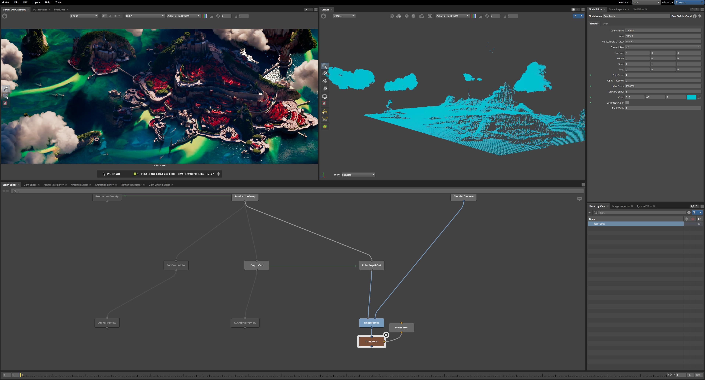

# Cycles Deep

**Deep alpha rendering for Cycles, with surface and volume support.**

This fork adds deep OpenEXR output alongside Cycles' normal beauty image. Instead
of one flattened alpha value per pixel, a deep file stores opacity at multiple
depths. That lets you slice through clouds, inspect overlapping geometry, and
select objects by ID in a compositing workflow.

*Beauty on the left, a deep point-cloud preview on the right, and the connected
Gaffer review graph below. User-supplied screenshot, preserved unchanged.*

## Why deep?

A flat image loses the layers behind each pixel. In full deep compositing, a
character can sit inside separately rendered smoke, with smoke both in front of
and behind it. Keeping depth and opacity lets compositors combine those elements
and revise their overlap with fewer holdout re-renders.
[Nuke's deep compositing guide](https://learn.foundry.com/nuke/16.0/content/comp_environment/deep/deep_compositing.html)
explains this workflow.

Studios use it for complex shots: Wētā managed overlapping characters in
*Rise of the Planet of the Apes*, while Atomic Fiction layered city atmospheres
in *Blade Runner 2049*. See [Foundry's studio examples](https://www.foundry.com/insights/film-tv/freedom-with-deep-compositing).

*Industry example only: this is **not our work and was not rendered with Cycles Deep**.
Blade Runner 2049 © 2017 Alcon Entertainment, LLC / Warner Bros. Entertainment Inc.
All rights reserved. Image courtesy of Atomic Fiction, hosted by Foundry.
[Watch the deep-compositing making-of](https://www.foundry.com/insights/film-tv/blade-runner-2049-compositing).*

Cycles Deep currently supplies the **visibility side** of that workflow:
opacity through clouds and surfaces, depth cuts, and object selection with deepID.
**Full deep colour compositing needs deep RGB, which is future work.** Deep data
also costs storage and processing; the sample cap and error controls make those
costs adjustable.

For the history and studio workflows, read Mike Seymour's
[The art of deep compositing](https://www.fxguide.com/fxfeatured/the-art-of-deep-compositing/)
(fxguide, 2014), including the distinction between deep opacity and deep colour.

## What it can do

- **Surfaces and volumes:** opaque and transparent surfaces, homogeneous volumes,
  and native VDB density grids.
- **deepID and holdouts:** select individual objects through a per-object UINT
  `id` channel and an object-name manifest in the EXR. Holdouts retain their camera opacity.
- **CPU, CUDA and OptiX:** SVM shaders on all three; OSL surface and volume shaders
  on CPU and OptiX.
- **Control size and cost:** choose a curve error tolerance, cap the number of deep
  camera samples, and merge nearby surface samples belonging to the same object.
- **Review in Gaffer:** depth cuts, flattened alpha, and a connected
  `DeepToPointCloud` preview. Gaffer is optional for rendering.

The deep channels are **Z, ZBack and A**, plus an optional UINT object `id`.
Depth is positive axial camera distance in scene units. **Deep RGB is not included**;
the normal beauty image is saved separately.

Enable deepID with `--deep-ids` and a numeric error setting, such as
`--deep-error 1e-3`. See [deepID usage](src/deep/README.md#deepid-and-holdouts)
for the ID mapping and exact selection rules.

## Tested on a full landscape

Both production runs passed the recorded numerical and beauty checks and were
accepted on 10 October 2026. The scene uses OptiX at **1175 × 500**, up to **1024
adaptive beauty samples**, GPU denoising, deep object IDs and a `1e-3` curve error
setting.

| | All deep camera samples | First 64 deep camera samples |
| --- | ---: | ---: |
| Render + capture | 67.91 min | 17.44 min |
| Deep export | 28.44 min | 3.01 min |
| Total | **96.35 min** | **20.45 min** |
| Deep EXR size | 1.99 GB | 705 MB |
| Deep samples in file | 281.8 million | 86.1 million |

| All-samples beauty | 64-sample deep capture, same beauty settings |
| --- | --- |
|  |  |

`Deep Samples` in Blender's **Render Properties → Film → Deep Visibility** controls
how many accepted camera rays per pixel contribute to deep capture: `0` uses all,
and `64` uses the first 64 (or fewer if adaptive sampling stops earlier).
The command-line equivalent is `--deep-samples N`. This does not cap depth layers.

The deep sample cap does **not** lower beauty sampling. It trades deep sampling
quality for capture and export cost. The error tolerance controls curve
approximation; it does not bound the sampling difference between these two runs.

See the [render evidence](docs/deep/evidence/README.md) for depth-cut images,
memory measurements, validation results, checksums and scene attribution.
Both [production deep EXRs are available as release downloads](https://github.com/brokenCushion/cycles/releases/tag/deep-output-evidence-2026-10-10).
The scene is **Scanlands by Piotr Krynski**, distributed under CC-BY-SA;
scene-derived images retain those terms.

## Getting started

This feature requires a build of this fork; it is not part of stock Blender.
The custom build exposes deep settings in the UI; deep EXR export currently
requires a background render.
The [documentation index](docs/deep/README.md) brings the guides together.
For code review or independent checks, see [developer verification](docs/deep/DEVELOPMENT.md).

1. [Build Cycles](BUILDING.md), or follow the
   [Blender integration instructions](docs/deep/BLENDER.md).
2. Read the [deep output guide](src/deep/README.md) for settings, file semantics
   and the regression command.
3. Use the [Gaffer node guide](src/deep/gaffer/README.md) for an interactive
   point-cloud review.

## Scope and validation

The [support matrix](docs/deep/SUPPORT.md) lists qualified features and
restrictions. Volumes currently require a static, mono perspective camera without
depth of field or motion blur. CUDA does not support OSL. Shader-evaluated volumes
use adaptive integration with a stated error estimate; features narrower than the
finest evaluated step can be missed.

The regression suite passed **81/81 strict**, **30/30 numeric** and **65/65 OptiX**
identity cases, nine CTests, exact CPU beauty checks, and beauty-source/kernel
resource checks. GPU beauty is checked using the recorded calibrated policy;
bit-identical GPU renders are not promised.

For implementation details and the final qualification rules, see the
[architecture and design rationale](docs/deep/ARCHITECTURE.md#why-this-design) and
[validation policy](docs/deep/VALIDATION.md).

## Future development

- **Deep RGB:** store colour alongside opacity and depth for deep compositing.
  Current deep files contain alpha, depth and optional object IDs; beauty is separate.
- **OSL shader AOVs on CPU and OptiX:** support custom colour/value render passes
  from OSL materials. This is a [planned side project](docs/plans/OSL_AOV.md),
  separate from deep output. OSL surface and volume deep capture already works
  on these backends within the support matrix.

These are future directions, with no committed implementation schedule.

## Upstream and license

Built on [Cycles](https://www.cycles-renderer.org), Blender's path tracing renderer.
Cycles can also be built as a standalone application or a Hydra render delegate.
The renderer is licensed under [Apache 2.0](LICENSE); image attribution and terms
are recorded on the [evidence page](docs/deep/evidence/README.md).

For upstream development and support channels, see
[Cycles development](https://www.cycles-renderer.org/development/).
