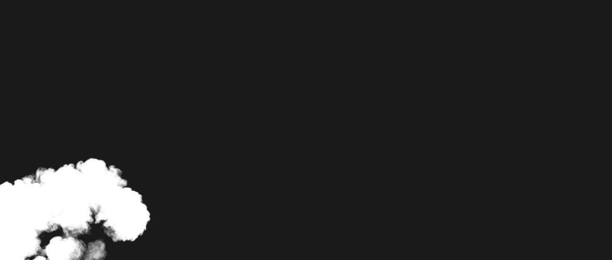
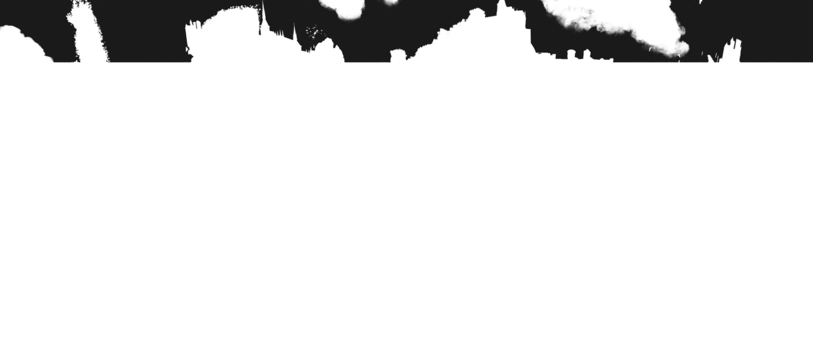

# Final landscape render evidence

Both Phase 9 production runs were accepted on 10 October 2026. These previews
come from the actual saved production files; no scene was re-rendered to make them.
[Results and SHA-256 checksums](results.json) identify the source outputs and each PNG.

## Beauty images

The scene's Filmic view transform was applied to each saved beauty EXR. Both runs
use the same original beauty sampling settings; the 64-sample cap applies to deep
capture only. The deep EXRs contain alpha, depth intervals and object IDs, not RGB.

| All accepted camera samples | First 64 camera samples per pixel |
| --- | --- |
|  |  |

## Depth cuts from the deep files

Gaffer `DeepSlice` retains samples up to the stated camera-ray depth, then flattens
alpha. Alpha is copied to RGB without a display transform: white is opaque and
black is transparent. Both columns use the same cut depth. These 8-bit PNGs are
visual previews; the numerical checks used the FLOAT EXRs.

| Cut depth | All samples | First 64 samples |
| --- | --- | --- |
| 759.322265625 |  |  |
| 1028.1962890625 |  |  |

## Measured production results

OptiX, 1175 x 500, maximum 1024 adaptive beauty samples (threshold 0.03, minimum 8),
GPU Open Image Denoise, seed 0, 24 threads. Both runs use `--deep-error 1e-3`,
`--deep-ids`, default `--deep-z-tolerance 1e-4` and `--deep-memory-mb 8192`.
Volumes use the native analytic VDB path.

| Measurement | All samples (`--deep-samples 0`) | First 64 (`--deep-samples 64`) |
| --- | ---: | ---: |
| Render + capture | 67.91 min | 17.44 min |
| Production export | 28.44 min | 3.01 min |
| Total render + capture + export | 96.35 min | 20.45 min |
| Separate same-capture validation export | 34.44 min | 3.20 min |
| Deep EXR | 1,994,272,718 bytes | 705,176,082 bytes |
| Deep samples in EXR | 281,796,920 | 86,125,949 |
| Spill file | 167.868 GB | 20.101 GB |
| Peak measured host memory | 5.717 GiB | 5.685 GiB |
| Peak total device GPU memory | 5738 MiB | 6217 MiB |
| Maximum accepted-camera oracle error | 8.22990e-5 | 8.22990e-5 |
| Maximum Gaffer depth-cut error | 2.60427e-6 | 2.84080e-7 |
| Final qualification | PASS | PASS |

GB means decimal bytes; GiB and MiB are binary units. The validation export is
excluded from the production total. These are two sampling settings, not a
controlled comparison against the original renderer. The error setting bounds
curve approximation; it does not bound the Monte Carlo difference caused by
using fewer deep camera samples.

## Validation and build identity

- Independent accepted-camera integration checks: 81 selected pixels and
  119,223,274 probes per run. Oracle error plus the measured surface-merging error
  stays within the EXR's `1e-3` header bound. Gaffer depth cuts and native accepted
  sample-population checks pass.
- Beauty uses the recorded CUDA/OptiX policy, with 20 ordinary deep-off controls
  and four seed-varied references. The count-rate/direction test retains its five
  primary controls. Both runs pass the final policy; GPU beauty is not claimed
  to be bit-identical across renders.
- All-samples pixel `(992,78)` needed the recorded root-cause resolution. In the
  separate majorant-snapshot + timing-fix diagnostic, deep on/off have the same
  sample count and all checked raw passes agree within the recorded ULP floors
  (also within the stricter reference-value 4-ULP rule). The snapshot patch is
  absent from the production build. The original flag and its resolution are
  retained separately in the qualification record.
- Regression: strict **81/81**, numeric **30/30**, OptiX **65/65**, nine CTests,
  CPU same-build beauty exactness, unchanged beauty sources and 75 kernel resource
  records. The retained regression replay took 721.844 seconds.

Production executable SHA-256:

```text
68e972491e66834ccdb0e61a183924e5fbee80d249eb4ef93fd7258fce844a64
```

Toolchain: clang-cl 20.1.8, NVCC 12.8.61 / CUDA 12.8.0, OptiX 8.0.0,
OSL 1.15.3.0. Compiled Cycles base: `8137045eb3f8e62e012a251ea93c548970c48716`,
plus scheduler timing fix `47a8dffb0`. Acceptance evidence is recorded at
commit `1fe60fe2f`. See the [support matrix](../../../src/deep/RELEASE_MATRIX.md)
and [qualification plan](../../../DEEP_OPTIMIZATION_PLAN.md) for scope.

The full deep EXRs and linear beauty EXRs are preserved outside Git. Their exact
sizes and checksums are listed in `results.json`; this page publishes compact
visual evidence rather than multi-gigabyte files.

## Scene attribution and image license

**Scanlands**, by **Piotr Krynski**, is the Blender 3.3 LTS demo scene, listed as
**CC-BY-SA** on [Blender's official demo-files page](https://www.blender.org/download/demo-files/).
The scene-derived PNGs in this folder retain those CC-BY-SA terms, separately
from the renderer's software license. Adaptations shown here are renders made
with this Cycles deep-output fork and grayscale depth-cut previews of its alpha.
The original scene and texture/VDB source assets are not included in this upload.
